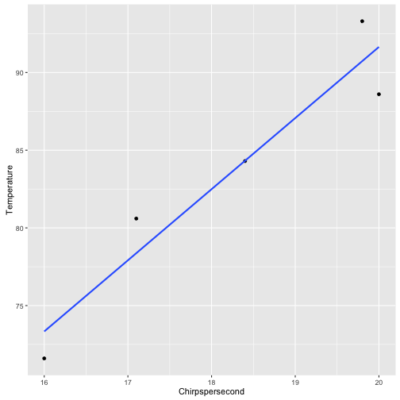

# Crickets dataset

## Our question: Do crickets chirp more when it is hotter?

### Striped Ground Crickets


## What do they sound like?
<iframe src="http://player.vimeo.com/video/81114843" height="200" width="680" allowfullscreen="" frameborder="0"></iframe>

## Taking a look at the data


```r
require(ggplot2)
d <- read.table('crickets.csv', sep=',', header=TRUE)
```

## Taking a look at the data


```r
d <- d[1:5, ]
print(d)
```

```
##   Chirpspersecond Temperature
## 1            20.0        88.6
## 2            16.0        71.6
## 3            19.8        93.3
## 4            18.4        84.3
## 5            17.1        80.6
```

## scatterplot of temperature by chirps per second


```r
ggplot(data=d, aes(x=Chirpspersecond, y=Temperature)) + geom_point() + geom_smooth(method='lm', se=FALSE)
```



### Are temperature and chirps per second related?


```r
mod <- lm(Temperature ~ Chirpspersecond, data=d)
```

Let's take a look!


```r
stargazer(mod, type='html')
```


<table style="text-align:center"><tr><td colspan="2" style="border-bottom: 1px solid black"></td></tr><tr><td style="text-align:left"></td><td><em>Dependent variable:</em></td></tr>
<tr><td></td><td colspan="1" style="border-bottom: 1px solid black"></td></tr>
<tr><td style="text-align:left"></td><td>Temperature</td></tr>
<tr><td colspan="2" style="border-bottom: 1px solid black"></td></tr><tr><td style="text-align:left">Chirpspersecond</td><td>4.577<sup>**</sup></td></tr>
<tr><td style="text-align:left"></td><td>(0.819)</td></tr>
<tr><td style="text-align:left"></td><td></td></tr>
<tr><td style="text-align:left">Constant</td><td>0.107</td></tr>
<tr><td style="text-align:left"></td><td>(14.999)</td></tr>
<tr><td style="text-align:left"></td><td></td></tr>
<tr><td colspan="2" style="border-bottom: 1px solid black"></td></tr><tr><td style="text-align:left">Observations</td><td>5</td></tr>
<tr><td style="text-align:left">R<sup>2</sup></td><td>0.912</td></tr>
<tr><td style="text-align:left">Adjusted R<sup>2</sup></td><td>0.883</td></tr>
<tr><td style="text-align:left">Residual Std. Error</td><td>2.820 (df = 3)</td></tr>
<tr><td style="text-align:left">F Statistic</td><td>31.266<sup>**</sup> (df = 1; 3)</td></tr>
<tr><td colspan="2" style="border-bottom: 1px solid black"></td></tr><tr><td style="text-align:left"><em>Note:</em></td><td style="text-align:right"><sup>*</sup>p<0.1; <sup>**</sup>p<0.05; <sup>***</sup>p<0.01</td></tr>
</table>

